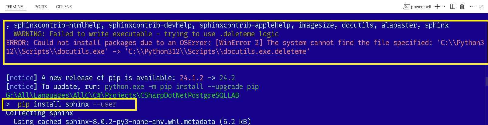

# Read the Docs documentation:
Creating documentation in a GitHub repository using Read the Docs involves several steps, from setting up your documentation structure to integrating with Read the Docs for automatic building and hosting. Here’s a step-by-step guide to get you started:

1. Prepare Your Documentation
First, you need to create the documentation files that Read the Docs will build. Most commonly, these are written in Markdown or reStructuredText formats.

Create a Documentation Directory: In your repository, create a directory (often named docs).
Write Documentation Files: Add Markdown or reStructuredText files. For example, a simple index.md or index.rst file can serve as the entry point.
2. Set Up Sphinx (Optional, but Recommended)
While Read the Docs supports both Sphinx and MkDocs, Sphinx is more commonly used for Python projects.

Install Sphinx: Run pip install sphinx to install Sphinx.

To Solve this Error, run:
```
pip install sphinx --user
```
This will install the tool in user folder.
Sphinx Quickstart: Run sphinx-quickstart in your docs directory. This command will create a basic configuration (conf.py) and some initial files.
Configure Sphinx: Edit the conf.py file if needed, to specify extensions, themes, and other options.
3. Create a requirements.txt File (If Needed)
If your documentation build requires specific Python packages (like sphinx or extensions), list them in a requirements.txt file in the root of your repository.

4. Configure Read the Docs
Now, you need to link your GitHub repository to Read the Docs.

Sign Up/Login to Read the Docs: Go to Read the Docs and sign up or log in.
Import Your Project: Follow the prompts to import your GitHub project. You can connect your GitHub account to make this easier.
Specify Your Documentation Requirements: During setup, if you have a requirements.txt file, point Read the Docs to it.
5. Set Up Webhooks
Read the Docs can automatically build your documentation whenever you push changes to your repository.

Automatic Webhooks: Read the Docs usually sets up a webhook automatically when you import your project. This triggers the documentation to build each time you push updates to your repository.
6. Customize Your Documentation Theme
You can customize the look and feel of your documentation using Sphinx themes. This can be done in the conf.py file.

Choose a Theme: Sphinx Themes offers a variety of options. The default is usually Alabaster.
7. Build and Review
Once everything is set up, push a commit or use the Read the Docs interface to manually trigger a build. Review the build output and your live documentation site to ensure everything looks as expected.

8. Link to Your Documentation
After your documentation site is live, you might want to add a link in your GitHub repository’s README file, pointing users to the hosted documentation.

By following these steps, your documentation should now be automatically built and hosted on Read the Docs whenever you update your documentation files in your GitHub repository.